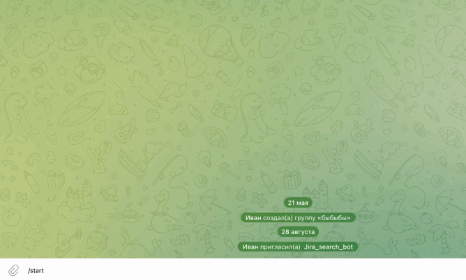

# 🤖 Jira Monitoring Telegram Bot

**Автоматический мониторинг задач Jira с уведомлениями в Telegram**

## 📱 Пример работы бота




Этот бот отслеживает изменения в колонке Jira *«Ожидают тестирования»* и уведомляет команду о новых задачах.

## ✨ Основные возможности

* 🔍 **Автоматический мониторинг** колонки Jira с настраиваемым интервалом проверки (задается в `config.py`)
* 📱 **Уведомления в Telegram** о новых задачах
* ⏰ **Система напоминаний** с возможностью взять задачу в работу
* 🔐 **Автоматическое обновление** сессии Jira при истечении токенов
* 📊 **Интерактивный интерфейс** с кнопками для навигации
* 🚀 **Фоновая работа** без вмешательства пользователя

## 🏗️ Архитектура проекта

```
├── main.py              # Главный файл приложения
├── config.py            # Конфигурация и настройки
├── monitor.py           # Система мониторинга задач
├── bot_handlers.py      # Обработчики команд Telegram
├── get_desk_api.py      # API для работы с Jira
├── cookie_manager.py    # Управление сессией Jira
├── auth_config.py       # Настройки авторизации
├── requirements.txt     # Зависимости Python
└── README.md            # Документация
```

## 🚀 Быстрый старт

### 1. Установка зависимостей

```bash
# Клонируйте репозиторий
git clone <repository-url>
cd Assistance_Jira

# Создайте виртуальное окружение
python -m venv venv

# Активируйте виртуальное окружение
# Windows:
venv\Scripts\activate
# macOS/Linux:
source venv/bin/activate

# Установите зависимости
pip install -r requirements.txt
```

### 2. Настройка переменных окружения

Создайте файл `.env` в корне проекта:

```env
# Telegram Bot
BOT_TOKEN=your_telegram_bot_token_here
WORK_CHAT_ID=your_work_chat_id_here

# Jira Credentials
JIRA_LOGIN=your_jira_username
JIRA_PASSWORD=your_jira_password

# Jira API URLs
JIRA_API_ARM_QA=https://your-jira-instance.com/rest/api/2/search
```

### 3. Настройка Jira

Убедитесь, что у вас есть доступ к Jira API и на доске существует колонка *«Ожидают тестирования»*.

### 4. Запуск бота

```bash
python main.py
```

## ⚙️ Конфигурация

Основные параметры настраиваются в `config.py`:

```python
# Интервал проверки новых задач (в секундах)
CHECK_INTERVAL = 300

# Интервал напоминаний (в секундах)
REMINDER_INTERVAL = 300

# Отслеживаемая колонка
MONITORED_COLUMN = "Ожидают тестирования"

# Режим отладки
DEBUG_MODE = True
```

## 🔧 Основные компоненты

### Monitor System (`monitor.py`)

* Отслеживает изменения в колонке Jira
* Отправляет уведомления о новых задачах
* Управляет системой напоминаний
* Работает в фоновом режиме

### Bot Handlers (`bot_handlers.py`)

* Обрабатывает команды (`/start` и др.)
* Показывает структуру досок и колонок
* Управляет кнопками «Взять задачу»
* Обрабатывает навигацию по интерфейсу

### Cookie Manager (`cookie_manager.py`)

* Автоматически обновляет сессию Jira
* Использует Selenium для входа
* Сохраняет и восстанавливает куки
* Обрабатывает ошибки 401

### API Client (`get_desk_api.py`)

* Выполняет запросы к Jira API
* Получает данные о задачах и колонках
* Автоматически обновляет куки при необходимости

## 📱 Использование бота

### Команды

* `/start` — показать доступные доски Jira

### Навигация

1. **Выбор доски** — выберите нужную доску (например, ARM\_QA)
2. **Просмотр колонок** — список всех колонок с количеством задач
3. **Детали колонки** — клик по колонке для просмотра задач
4. **Просмотр задачи** — клик по задаче для деталей

### Уведомления

* 🔔 **Новые задачи** — автоматически при появлении
* ⏰ **Напоминания** — каждые 300 секунд для невзятых задач
* 💼 **Взятие задач** — кнопка для отметки «Взял в работу»

## 🔒 Безопасность

* Токены и пароли хранятся в `.env`
* Автоматическое обновление сессии Jira
* Проверка прав доступа к чату Telegram
* Логирование действий для отладки

## 🐛 Отладка

Включите отладку в `config.py`:

```python
DEBUG_MODE = True
SHOW_CHECK_STATUS = True
```

Логи будут выводиться в консоль с подробной информацией.

## 📋 Требования

* Python 3.8+
* Chrome/Chromium (для Selenium)
* Доступ к Jira API
* Telegram Bot Token
* Права на отправку сообщений в чат

## 🔧 Устранение неполадок

### 401 Unauthorized

* Бот автоматически обновит куки
* Проверьте логин/пароль в `.env`

### Бот не отправляет сообщения

* Проверьте `BOT_TOKEN` и `WORK_CHAT_ID`
* Убедитесь, что бот добавлен в чат
* Проверьте права бота

### Не работает мониторинг

* Проверьте доступность Jira API
* Убедитесь, что колонка существует
* Просмотрите логи

## 📈 Мониторинг и статистика

Бот отслеживает:

* Количество задач в колонке
* Время появления новых задач
* Статус взятия задач
* Активность системы напоминаний

## 🤝 Вклад в проект

1. Форкните репозиторий
2. Создайте ветку для новой функции
3. Внесите изменения
4. Создайте Pull Request

## 📄 Лицензия

Проект распространяется под лицензией MIT. Добавьте файл `LICENSE` в корень репозитория.

## 📞 Поддержка

При возникновении проблем:

1. Проверьте логи в консоли
2. Убедитесь в правильности настроек
3. Создайте Issue в репозитории

---

**Автор:** Иван Андриянов

